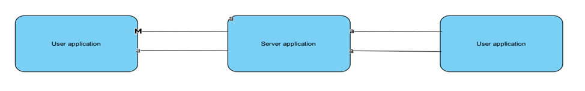
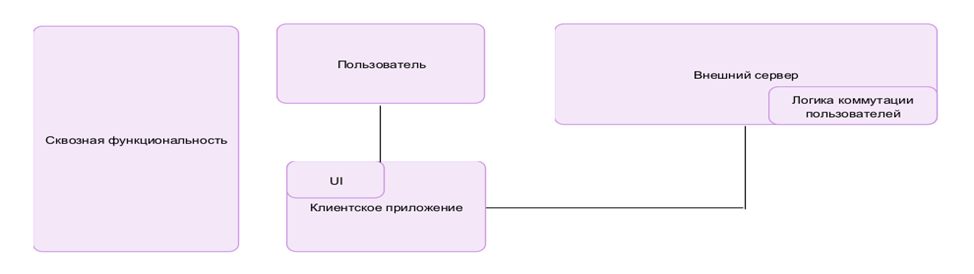
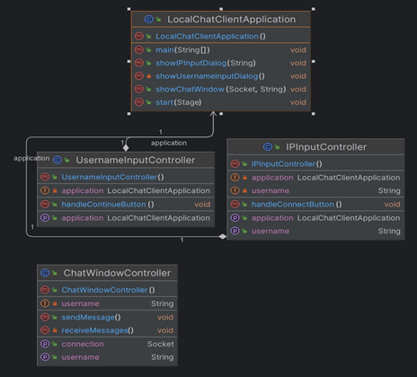
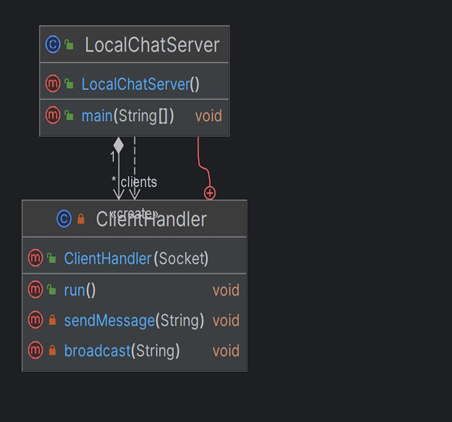

## Исследование архитектурного решения
### __Часть 1:__ Проектирование архитектуры
1. __Тип приложения:__ Desktop-Application;
2. __Стратегия развёртывания:__ Распределённое равзвёртывание, где все слои располагаются на разных физических уровнях: _см. рис. 1_;
 
 ##### _В данном случае используется 2-уровневое развёртывание, в котором клиент взаимодействует с другим клиент при посредничестве серверного приложения._
3. __Показатели качества:__ простота, удобство, надёжность;
4. __Пути реализации сквознйо функциональности:__ авторизация, аутентификация;
5. __Структурная схема приложения в виде функциональных блоков:__ _см. рис. 2_.

### __Часть 2: Анализ архитектуры__
__Диаграмма классов клиентского и серверного приложений__ (_см. рис. 3, 4_):

##### _Клиентское приложение_

##### _Серверное приложение_

### __Часть 3: Сравнение и рефакторинг__
На данном этапе сравнения архитектур "As is" и "To be" следует отметить, что архитектура "To be" описывает общую концепцию реализации Desktop-приложения, а "As is" демонстрирует логику реализации Back-end составляющей общения между сервером и клиентами.В данном случае возможным улучшением данной архитектуры является добавление шифрования данных.
