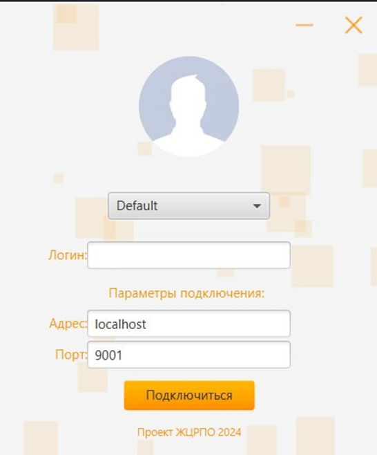
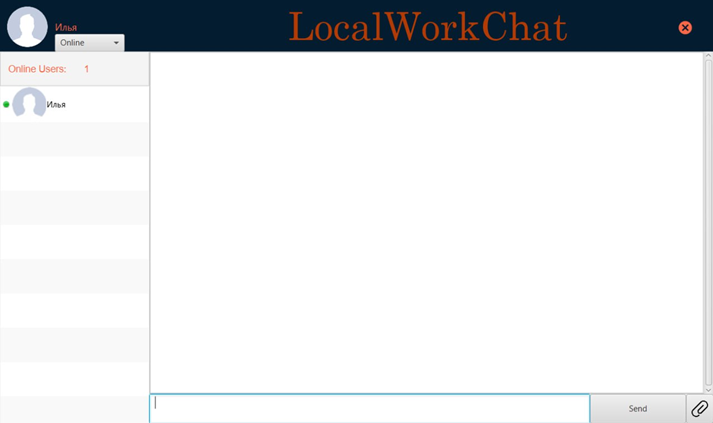
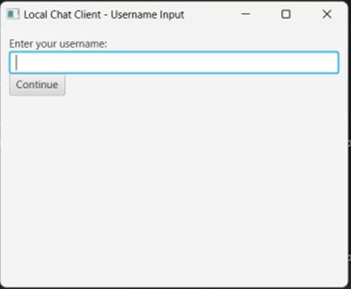
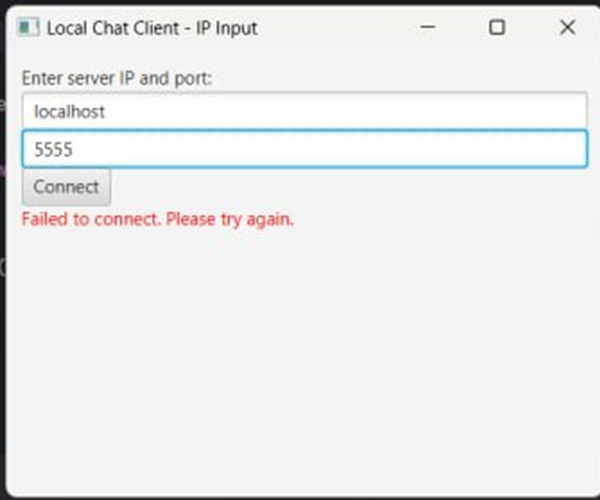
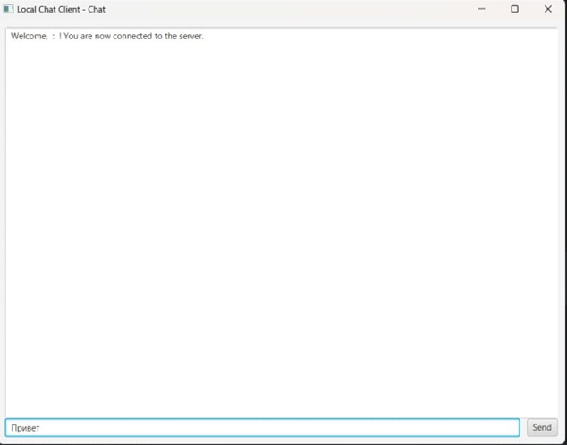

### Уровни "Опыта использования"
#### 1. __Уровень поверхности__

   На уровне поверхности мессенджера для устройств внутри компании в локальной сети представлен простой и интуитивно понятный интерфейс, который удовлетворяет потребности пользователей в обмене сообщениями и файлами. Внешний вид приложения создан с учетом минимализма и легкости использования.
   
__Экран входа:__
   - Поле ввода имени пользователя, адреса и порта подключения.
   - Кнопка "Подключиться" для входа в систему.
   
   - 

__Главный экран:__
   - Список чатов с другими устройствами компании.
   - Выбор состояния пользователя.
   - Возможность просмотра непрочитанных сообщений.
   - Возможность отправления файлов пользователям.
   
   - 

__Уведомления:__
   - Пуш-уведомления о подключении пользователя к сети и новых сообщений от пользователей.
   
   - 

#### 2. __Уровень компоновки__

   На уровне компоновки мессенджера для устройств внутри компании в локальной сети реализована эффективная организация элементов интерфейса для обеспечения удобства пользователей при взаимодействии с приложением.
   
__Расположение списка чатов:__
   - Список чатов отображается слева на главном экране приложения.
   - Каждый чат представлен карточкой, содержащей информацию о собеседнике и последнем сообщении.
   
__Интерфейс чата:__
   - Элементы для ввода текста и отправки сообщений находятся в нижней части экрана для удобства.
   - Кнопка для прикрепления файлов находится рядом с полем ввода сообщения.
   - Сообщения отображаются в виде разговорной цепочки с четким разделением между ними.
   
__Индикация статуса:__
   - Статус онлайн/оффлайн других устройств отображается рядом с их именами в списке чатов и внутри чата для удобства пользователя.

#### 3. __Уровень структуры__

   На уровне структуры мессенджера для устройств внутри компании в локальной сети определена ясная организация различных разделов и функциональных возможностей приложения для обеспечения эффективной навигации и пользовательского опыта.
   
__Главный экран:__
   - Главный экран представляет собой экран входа пользователя на экран чата с пользователями.
   
__Экран чата:__
   - После выбора конкретного чата пользователь видит интерфейс для обмена сообщениями и файлами с выбранным устройством.
   - На этом экране отображается история сообщений, поле для ввода новых сообщений и кнопки для прикрепления файлов и отправки сообщений.
   
__Меню навигации:__
   - Меню навигации предоставляет доступ к различным разделам приложения, таким как список чатов, отображения состояния пользователей.
   - Это меню располагается в левой боковой панели для удобства пользователей.

#### 4. __Уровень набора возможностей__

   На уровне набора возможностей мессенджера для устройств внутри компании в локальной сети представлен перечень функциональных возможностей, которые доступны для пользователей приложения.
   
__Отправка текстовых сообщений:__
   - Пользователи могут обмениваться текстовыми сообщениями с другими устройствами в сети компании.
   
__Передача файлов:__
   - Пользователи имеют возможность отправлять и принимать файлы различных форматов, таких как документы, изображения, видео и аудиофайлы.
   
__Статус онлайн/оффлайн:__
   - Пользователи могут видеть статус онлайн/оффлайн других устройств в списке чатов для определения их доступности.
   
__Настройки профиля:__
   - Пользователи имеют возможность настроить параметры своего профиля, такие как имя пользователя, фотография профиля и статус.
   
__Интеграция с системой компании:__
   - Приложение может быть интегрировано с другими системами компании для обмена данными и автоматизации бизнес-процессов.

#### 5. __Уровень стратегии__

   На уровне стратегии определены основные цели и направления развития мессенджера для устройств внутри компании в локальной сети, а также учитываются потребности и ожидания как потенциальных пользователей, так и заказчика.
   
__Цели продукта:__
   - Обеспечение эффективного внутреннего обмена информацией и файлами между устройствами компании.
   - Повышение производительности и эффективности работы сотрудников за счет удобного и быстрого доступа к необходимым данным.
   - Ожидания относительно пользовательского опыта:
   - Простой и интуитивно понятный интерфейс для обеспечения удобства использования даже для пользователей без технических навыков.
   - Быстрая и надежная передача сообщений и файлов между устройствами с минимальными задержками и проблемами.
   
__Потребности пользователей:__
   - Необходимость в эффективном средстве коммуникации для оперативного обмена информацией с коллегами и руководством.
   - Требование к безопасности и конфиденциальности данных при передаче чувствительной информации внутри компании.
   
__Основные возможности для реализации:__
   - Разработка механизмов шифрования для обеспечения безопасности данных при передаче через локальную сеть.
   - Внедрение функциональности, обеспечивающей быстрый и надежный обмен сообщениями и файлами даже при высокой загруженности сети.
   
__Стратегические направления развития:__
   - Постоянное совершенствование и доработка функциональности приложения на основе обратной связи от пользователей.
   - Исследование новых технологий и методов для улучшения производительности и безопасности приложения.

#### Улучшения интерфейса для лучшего использования клиентами:
   
__Улучшенный дизайн главного экрана:__
   - Переработан дизайн списка чатов для более привлекательного внешнего вида.
   - Добавлены ярлыки для быстрого доступа к часто используемым чатам.
   
__Улучшенная навигация:__
   - Реорганизовано меню навигации для более интуитивного доступа к различным разделам приложения.
   - Добавлена возможность перехода к последнему активному чату по нажатию на иконку в нижнем меню.
   
__Более удобный интерфейс чата:__
   - Улучшен интерфейс для отправки сообщений с добавлением кнопки "Отправить" прямо на клавиатуре для удобства пользователей.
   
__Улучшенная настройка профиля:__
   - Добавлена возможность установки статуса "Не беспокоить", чтобы пользователи могли временно отключить уведомления о новых сообщениях.
   
#### Интерфейс до улучшения:
   
   
   

#### Интерфейс после улучшения:
   
   
